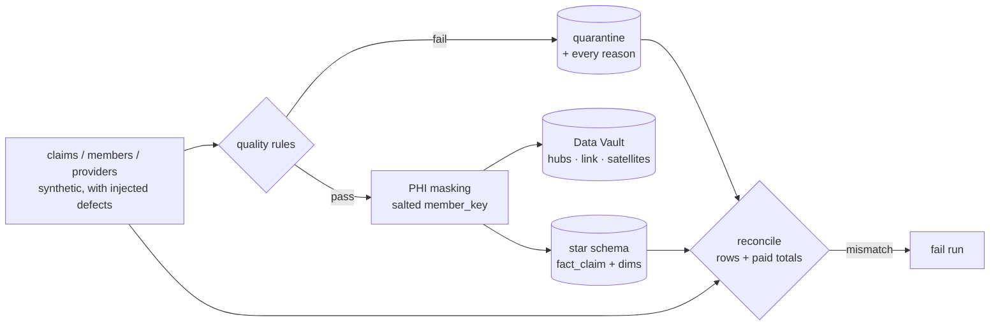

# healthcare-claims-dq

A PySpark claims pipeline with HIPAA-style de-identification, declarative data-quality gates with quarantine, a raw **Data Vault 2.0** layer, a business **star schema**, and source-to-target **reconciliation** that fails the run when counts or dollars don't tie out. **All members, providers and claims are synthetic.**



## What each module does

| Module | Details |
|---|---|
| `claims/generate.py` | Members, providers and claims with seven defect types plus exact-duplicate resubmissions |
| `claims/quality.py` | Rules for missing NPI, negative amounts, paid > billed, ICD-10 format, future service date, paid-before-service, orphan member. Exact duplicates are dropped; failing rows are quarantined with **all** their reasons |
| `claims/masking.py` | Drops direct identifiers (name, SSN), salted SHA-256 `member_key`, DOB → birth year, ZIP → ZIP3 |
| `claims/vault.py` | `hub_member`, `hub_provider`, `hub_claim`, `link_claim_member_provider`, `sat_claim`, `sat_member` with hash keys, hashdiffs, `load_ts`, `record_source`; insert-only satellite deltas |
| `claims/star.py` | `fact_claim` (patient responsibility, days to pay), `dim_member`, `dim_provider`, `dim_date` |
| `claims/reconcile.py` | Row and paid-amount conservation: source = valid + quarantine, fact = valid |

## Sample run

```text
input 2020 · duplicates 20 · valid 1893 · quarantined 107
checks: rows_conserved ✓  paid_conserved ✓  fact_matches_valid_rows ✓  fact_matches_valid_paid ✓
top reasons: paid_gt_billed 29 · negative_amount 18 · future_service 18 · bad_icd 17 · orphan_member 17
```

## Run it

```bash
pip install -r requirements.txt          # needs Java 17+
PHI_SALT=change-me python -m claims.pipeline --out output
pytest -q
```

## Tests

- Every injected defect is quarantined with the right reason, and duplicates are removed
- The ICD-10 pattern accepts real codes and rejects malformed ones
- No direct identifiers survive masking; pseudonyms are stable per salt and change with the salt
- Satellites insert only rows whose hashdiff changed
- The end-to-end run reconciles and writes every table; reconciliation raises when rows go missing

## Notes

The salt comes from `PHI_SALT`. In production it belongs in a secret manager, not in code. The same patterns carry over to Databricks: write Delta instead of parquet, `MERGE` the hubs and links, and run the reconciliation as a job task that gates downstream tasks.
